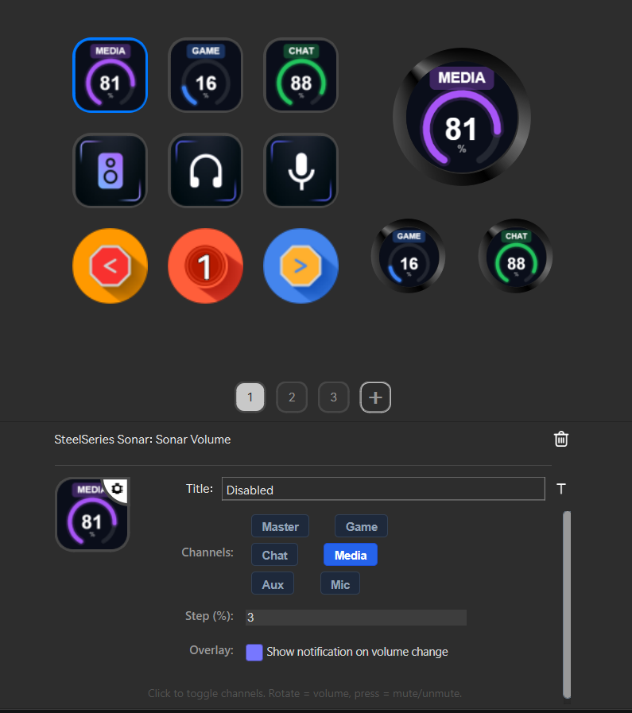

<p align="center">
  
</p>

<h1 align="center">Sonar2StreamDeck</h1>

<p align="center">
  Control <a href="https://steelseries.com/gg/sonar">SteelSeries Sonar</a> straight from your dock — no more alt-tabbing into GG to swap your output device or nudge a channel's volume. Press a button, turn a dial, done.
</p>

A plugin for [StreamDock](https://www.hotspottek.com/) (Ajazz/Mirabox) that talks to Sonar's local API directly, with a couple of details that make it actually pleasant to live with day to day: real device names instead of guesses, custom icons per device, a proper on-screen notification when something changes, and the ability to hide the devices you never use from the rotation.

<p align="center">
  
  <br/>
  <sub>Volume dials, device cycler, and the property inspector — including the notification toggle</sub>
</p>

---

## Actions

### 🔊 Game Device Cycler

One button, every output device you care about, in order.

- Cycles through all of Sonar's available output devices with a single press
- Drives one or several channels at once — any combination of **Game**, **Chat**, **Media**, **Aux** — so one press can retarget your whole setup, not just one channel
- **Exclude devices you never use** — toggle any device off in the property inspector and the cycle skips straight past it. Change your mind later and toggle it back on.
- Full, untruncated device names in the property inspector, so "Realtek(R) Audio" doesn't get mangled into something unreadable
- Auto-detected icon per device — headset, laptop/integrated speakers, HDMI/display output, or generic speaker — or **classify it yourself** in the property inspector if the guess is wrong, or upload your **own icon** per device if you'd rather see something custom on the key
- The mic capture device cycles in lockstep with the output, so your input follows your output automatically
- A notification card confirms what you just switched to — device name, mic if it changed too — since Sonar's own overlay only reacts to Sonar's own app, not third-party control

### 🎚️ Volume Knob

A proper hardware volume dial for Sonar.

- Works on any StreamDock dial — rotate to adjust, press (or press the dial) to mute/unmute
- Also works as a plain button if you don't have a dial: press to toggle mute
- Configurable step size per tick (1–10%)
- Control multiple channels from one dial — e.g. Game + Chat together, always in sync
- A live arc on the key face shows the current level at a glance, and turns red the moment you mute
- A notification card tracks the level live as you turn the dial, and flips to a red "MUTED" state when you mute

---

## Requirements

- [SteelSeries GG](https://steelseries.com/gg) with **Sonar** installed and running
- [Ajazz/Mirabox StreamDock](https://www.hotspottek.com/) software

## Installation

1. Download or clone this repo
2. Copy the `com.igorcretu.streamdock.sonar.sdPlugin` folder into your StreamDock plugins directory:

   ```text
   %APPDATA%\HotSpot\StreamDock\plugins\
   ```

3. Restart StreamDock
4. The **SteelSeries Sonar** category will appear in the action list

---

## Configuration

### Game Device Cycler

Open the property inspector for the button:

- **Channels** — toggle which Sonar channels get switched when you press the button. All active channels are switched to the same device together.
- **Overlay** — turn the notification card off if you'd rather not see it for device changes.
- **Device Icons** — click a device thumbnail (or `+ Icon`) to upload a custom image for that device; click the red **✕** to revert to the auto-detected icon.
- **Exclude** — click the toggle next to a device to drop it from the cycle. Excluded rows dim so you can see at a glance what's active. If you exclude everything, the cycle quietly falls back to the full list rather than getting stuck.
- **Type** — Auto guesses the device category from its name (headphones, speaker, laptop, display); override it here if the guess is wrong. Drives both the notification card's icon and the key art's icon when no custom icon is set.

### Volume Knob

- **Channels** — select which channels the knob controls; select more than one to keep them in sync.
- **Step** — how many percent each tick of the dial changes the volume (default: 3%).
- **Overlay** — turn the notification card off if you'd rather not see it for volume/mute changes.

---

## How it works

The plugin talks to Sonar's local HTTP API, discovered at startup via SteelSeries GG's `coreProps.json` (and cached until something fails, at which point it's rediscovered automatically — handy if GG restarts). Writes go through Node's `http` module directly rather than the browser's `fetch`, which sidesteps the CORS restrictions that would otherwise block `PUT` requests to a local API from a webview.

Key art — the volume arc, the device icons, the offline state — is composited live on an HTML canvas and pushed to the key as an image, so what you see always reflects real device names, real icons, and the real current volume rather than a static asset.

**Why a custom notification card instead of Sonar's own overlay:** Sonar's native pop-up is wired through Electron IPC internal to the SteelSeries GG process — it's not exposed over Sonar's local API at all, hardware shortcuts included only because GG's own hotkey handling lives in that same process. So the plugin drives its own: `overlay/overlay-host.ps1` is a small persistent WPF window, started lazily on first use (no admin rights needed) and reused for the rest of the session. The plugin reaches it over a local HTTP port rather than a named pipe, since — same as the Sonar API calls above — the plugin runs in a webview with no `child_process`/`net` access, only `fetch()`.

---

## Known limitation: the notification card won't show over some fullscreen games

Windows renders true **exclusive fullscreen** by handing the display output directly to the game, bypassing the desktop compositor (DWM) entirely — so no ordinary always-on-top window can render over it. This isn't specific to this plugin: Windows' own volume/battery pop-ups, Xbox Game Bar, and most third-party overlays hit the same wall for the same reason. (Discord, Steam, and Sonar's own native overlay work around it by hooking directly into the game's graphics pipeline — a different, much heavier-weight technique this plugin deliberately doesn't do.)

The fix that works for the vast majority of games: right-click the game's `.exe` (or its shortcut) → **Properties → Compatibility** → make sure **"Disable fullscreen optimizations"** is **unchecked**. Most modern games run this way by default, which keeps DWM in the loop and lets the notification card (and every other overlay) render normally. If the game offers a **Borderless** or **Windowed Fullscreen** display mode, that works too, and sidesteps the question entirely.

---

## License

MIT
